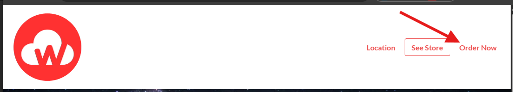

# How to Add a Custom Link to Your Cloudwaitress Landing Page

### Steps:

1. Log in as Admin at admin.cloudwaitress.com
2.  On the top navigation tabs, look for and click “Landing Page.”

    .png>)
3. Under the Website Sections, click “Nav Bar.”
4.  In the Links area, change Select Link Type to “Custom.”

    .png>)
5. Click “Add Link.”
6. In the Link Text field, enter the label you want to appear on the top navigation bar
7.  In the Links To field, paste the full custom URL you want the link to open.

    .png>)
8. Click Save to apply the changes.
9.  It will now show the Text you created on the frontend of the Landing Page

    
